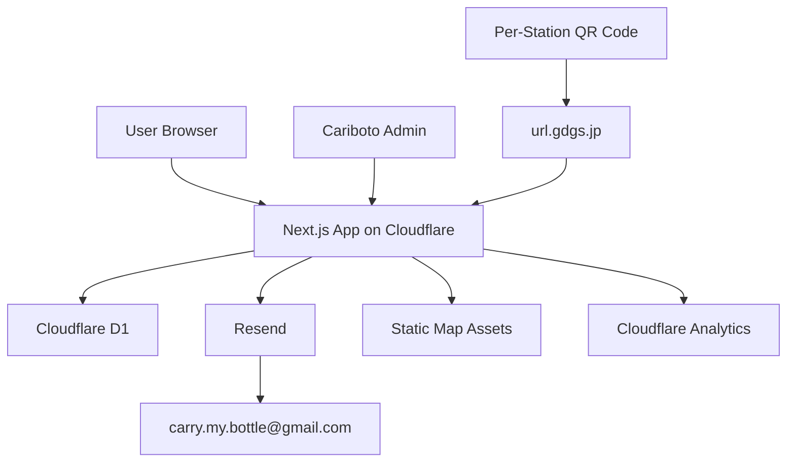
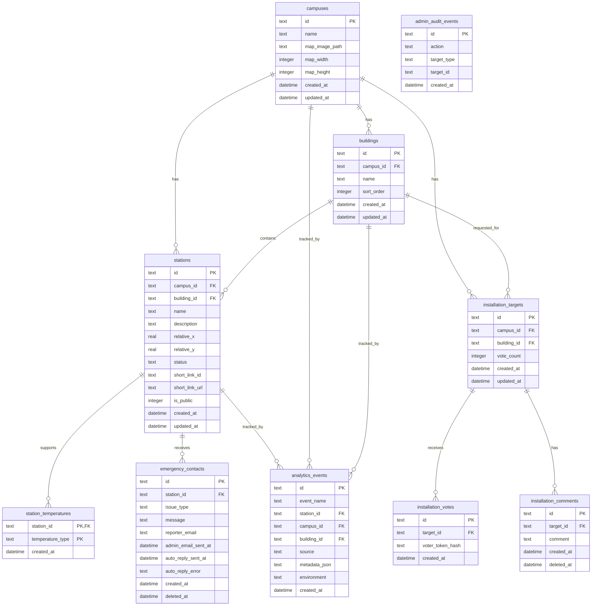

 # Design Doc: キャリボト Web マッププロジェクト

## Index

- [0. Document Status](#0-document-status)
- [1. Overview and Goals](#1-overview-and-goals)
- [2. Architecture](#2-architecture)
- [3. Routing and User Flows](#3-routing-and-user-flows)
- [4. Data Model](#4-data-model)
- [5. Map Image and Pin Coordinate Design](#5-map-image-and-pin-coordinate-design)
- [6. Water Station Features](#6-water-station-features)
- [7. Installation Request and Voting](#7-installation-request-and-voting)
- [8. Emergency Contact](#8-emergency-contact)
- [9. Admin Console and Authentication](#9-admin-console-and-authentication)
- [10. Landing Page](#10-landing-page)
- [11. QR Code and Short Link Operations](#11-qr-code-and-short-link-operations)
- [12. Analytics and Privacy](#12-analytics-and-privacy)
- [13. Deployment and Environments](#13-deployment-and-environments)
- [14. MVP Scope, Post-MVP, and Fallback](#14-mvp-scope-post-mvp-and-fallback)
- [15. Risks and Mitigations](#15-risks-and-mitigations)
- [16. Open Items](#16-open-items)
- [17. Implementation Notes](#17-implementation-notes)

## 0. Document Status

本書は `PRD.md` をもとに、給水機マップ Web アプリおよびキャリボト LP サイトの実装方針を整理する Design Doc である。

初回リリースは 2026 年 6 月中旬を目標とする。MVP ではユーザー向け体験を優先しつつ、管理者が給水機情報・設置希望・緊急連絡を最低限運用できる状態を目指す。

## 1. Overview and Goals

### 1.1 Product Scope

本プロダクトは、阪大内の給水機の場所・稼働状態・水温種別を確認できる Web アプリと、キャリボトの活動を紹介する LP サイトで構成する。

MVP では以下を同一アプリケーション内に実装する。

- キャリボト LP サイト
- 給水機マップ
- 給水機詳細
- 設置希望・投票
- 緊急連絡フォーム
- 管理画面
- QR コード経由アクセス
- 最小限の分析イベント保存

### 1.2 Goals

- 豊中・吹田・箕面キャンパスの給水機を地図画像上で確認できる。
- 給水機ごとに利用可能状態、停止中、故障中を表示できる。
- 給水機ごとに冷水、常温水、温水の水温種別を表示できる。
- MVP では現在地ピンは出さないが、キャンパス選択、建物情報、地図上ピン、一覧表示により、ユーザーが現在地と給水機の位置関係を把握しやすい体験を提供する。
- ユーザーが給水機設置希望を建物単位で投稿・投票できる。
- 希望調査画面で、キャンパスごとのリクエスト状況リストを確認できる。
- 設置希望場所を建物タブで選択できる。
- 階数や詳細場所をコメント欄に入力できる。
- ユーザーが給水機の故障・停止・異常を緊急連絡できる。
- 管理者が給水機情報、設置希望、緊急連絡を管理できる。
- キャリボトのホームページまたは関連ページへの導線を提供できる。
- 給水機ごとの QR コードから該当給水機詳細へ遷移できる。
- QR コードには `url.gdgs.jp` の短縮リンクを使い、リリース後にリンク先を変更できる導線を提供する。
- LP サイトからキャリボト活動の概要と給水機マップへの導線を提供できる。
- LP サイトで、キャリボト活動概要、給水機プロジェクト背景、マイボトル利用促進の目的、問い合わせ導線または関連リンクを提供する。
- スマートフォン優先 UI とし、PC でも最低限利用できるレスポンシブ表示を提供する。
- 2027 年度以降のマイハンダイ掲載に向けた利用実績・運用実績を残せる。

### 1.3 Non-Goals for MVP

- Mapbox、OpenStreetMap などによる本格的な地図実装。
- 現在地ピンの表示。
- 最寄り給水機の自動算出。
- ルート案内。
- 音声案内。
- 給水量の自動取得。
- IoT / マイコン連携。
- 個別管理者アカウント。
- 管理画面の詳細な監査ログ。
- 緊急連絡フォームの写真添付。

## 2. Architecture

### 2.1 High-Level Architecture

Decision:

- アプリケーションは Next.js フルスタック構成とする。
- ホスティングと実行基盤は Cloudflare を前提とする。
- Next.js を Cloudflare で動かす方式は OpenNext for Cloudflare を使用する。
- DB は Cloudflare D1 を使用する。
- メール送信は Resend を使用する。
- 短縮リンクは `url.gdgs.jp` を使用する。
- 分析は Cloudflare 中心の最小構成とし、必要なイベントはアプリ側で D1 に保存する。



### 2.2 Application Responsibilities

Next.js アプリは以下を担当する。

- LP 表示
- 給水機マップ表示
- 給水機詳細表示
- 設置希望投稿・投票
- 緊急連絡フォーム
- 管理画面
- API / Server Actions / Route Handlers
- D1 への読み書き
- Resend 経由の管理者通知
- セッション Cookie の発行・検証
- QR 経由イベントの保存

### 2.3 Cloudflare Runtime Constraints

Cloudflare 上で Next.js を動かすため、以下を前提とする。

- Node.js のファイルシステム書き込みに依存しない。
- 長時間実行処理を避ける。
- 画像アップロードやファイル保存は MVP では扱わない。
- 地図画像などの静的アセットはビルド成果物または Cloudflare 側で配信する。
- Next.js の画像最適化機能に強く依存しない。
- Cloudflare Workers 環境で利用可能な Web API を中心に実装する。

### 2.4 Application Architecture and Directory Structure

Decision:

- Next.js 16 App Router を前提にする。
- アプリケーションコードは `src/` 配下にまとめる。
- `src/app` は URL ルーティングと Next.js の特殊ファイルを置く薄い route adapter とする。
- 実装本体は feature-based に整理し、`src/features/*` に置く。
- 共通処理は `src/lib/*` に置く。
- 汎用 UI は `src/components/*` に置く。
- 入力検証は Zod に統一する。
- DB アクセスは Drizzle ORM に統一する。
- Drizzle schema と migrations は `src/lib/db` に集約する。
- D1 binding から Drizzle client を生成する `getDb(d1: D1Database)` を `src/lib/db/client.ts` に用意する。
- repository 層は厚く作らず、機能ごとの `queries.ts` で Drizzle query を実行する。
- Server Actions は基本的に `src/features/*/actions.ts` に置く。

想定ディレクトリ構成:

```text
src/
  app/
    page.tsx
    map/page.tsx
    stations/[stationId]/page.tsx
    requests/page.tsx
    contact/[stationId]/page.tsx
    admin/
      layout.tsx
      page.tsx
      login/page.tsx
      stations/page.tsx
      requests/page.tsx
      contacts/page.tsx
  features/
    landing/
      LandingPage.tsx
    map/
      MapPage.tsx
      MapCanvas.tsx
      actions.ts
      queries.ts
      schema.ts
    stations/
      StationDetailPage.tsx
      actions.ts
      queries.ts
      schema.ts
    requests/
      RequestsPage.tsx
      actions.ts
      queries.ts
      schema.ts
    contact/
      ContactPage.tsx
      actions.ts
      queries.ts
      schema.ts
    admin/
      AdminDashboardPage.tsx
      actions.ts
      queries.ts
      schema.ts
  components/
    ui/
  lib/
    db/
      client.ts
      schema.ts
      types.ts
      migrations/
      seed.ts
    auth/
    mail/
    rate-limit/
    utils/
```

`src/app` の `page.tsx` は、該当する `features` の Page コンポーネントを呼び出す薄いファイルにする。

例:

```tsx
import { MapPage } from "@/features/map/MapPage";

export default function Page() {
  return <MapPage />;
}
```

動的ルートでは、Next.js 16 の async Request APIs を前提に `params` / `searchParams` を `await` してから feature 側へ渡す。

```tsx
import { StationDetailPage } from "@/features/stations/StationDetailPage";

export default async function Page(props: PageProps<"/stations/[stationId]">) {
  const { stationId } = await props.params;
  return <StationDetailPage stationId={stationId} />;
}
```

Next.js 16 前提の注意点:

- `params` / `searchParams` は Promise として扱う。
- `cookies()` / `headers()` などの Request APIs は async 前提で扱う。
- `page.tsx`, `layout.tsx`, `loading.tsx`, `error.tsx`, `not-found.tsx`, `route.ts` は `src/app` 側に置く。
- `features` 配下では `page.tsx` という特殊ファイル名を避け、`MapPage.tsx` のような明示的な名前にする。
- route 固有の小さな実装詳細を `src/app` 側に置く場合は、`_components` や `_actions` のような private folder を使ってルーティング対象外であることを明示する。
- `middleware.ts` ではなく Next.js 16 の `proxy.ts` 規約を意識する。ただし MVP の管理画面認証は Server Component の admin layout と admin Server Actions のサーバー側ガードで実装する。
- Node.js 20.9+、TypeScript 5.1+ を前提にする。
- Turbopack がデフォルトであるため、Webpack 前提の設定に依存しない。
- `next lint` ではなく ESLint CLI を使う。

## 3. Routing and User Flows

### 3.1 Routes

Decision:

- `/` は LP サイトとする。
- `/map` は給水機マップとする。
- `/stations/[stationId]` は給水機詳細とする。
- `/requests` は設置希望・投票画面とする。
- `/contact/[stationId]` は給水機に紐づく緊急連絡フォームとする。
- `/admin/login` は管理画面ログインとする。
- `/admin` は管理画面トップとする。
- `/admin/stations` は給水機管理とする。
- `/admin/requests` は設置希望管理とする。
- `/admin/contacts` は緊急連絡管理とする。

### 3.2 Main User Flow: LP to Map

- ユーザーが `/` にアクセスする。
- キャリボトの活動概要、給水機プロジェクトの背景、マイボトル利用促進の目的を確認する。
- CTA から `/map` に遷移する。
- キャンパスを選択し、給水機の位置と状態を確認する。

### 3.3 Main User Flow: Find a Water Station

- ユーザーが `/map` にアクセスする。
- キャンパスを選択する。
- キャンパスごとの地図画像が表示される。
- 地図上に相対座標で給水機ピンが表示される。
- ユーザーはピンチズーム・パンで地図を拡大・移動できる。
- ユーザーがピンを選択する。
- 給水機詳細または詳細パネルを表示する。

### 3.4 Main User Flow: QR Code

- ユーザーが給水機に掲示された QR コードを読み取る。
- QR コードは `url.gdgs.jp` の短縮リンクに遷移する。
- 短縮リンクは `/stations/[stationId]?source=qr&station_id=[stationId]` に遷移する。
- アプリは QR 経由アクセスとしてイベントを保存する。
- ユーザーは該当給水機の詳細を確認する。

### 3.5 Main User Flow: Installation Request

- ユーザーが `/requests` にアクセスする。
- キャンパスを選択する。
- キャンパスごとのリクエスト状況リストを確認する。
- 建物タブから設置希望場所を選択する。
- ユーザーは選択した建物に対して投票する。
- 必要に応じて階数や詳細場所をコメント欄に入力する。
- コメントは公開側には表示せず、管理者向け情報として保存する。
- 同じブラウザから同じ建物への再投票は 7 日のクールダウンを設ける。

### 3.6 Main User Flow: Emergency Contact

- ユーザーが給水機詳細から緊急連絡フォームを開く。
- issue type、内容、連絡者メールアドレスを入力する。
- フォームを送信する。
- アプリは D1 に緊急連絡を保存する。
- Resend 経由で `carry.my.bottle@gmail.com` に通知する。
- Resend 経由で連絡者メールアドレスに送信完了メールまたは自動返信を送る。
- 画面上にも送信完了を表示する。

## 4. Data Model

### 4.1 Data Modeling Principles

Decision:

- D1 を主データストアとする。
- DB アクセスには Drizzle ORM を採用する。
- Drizzle schema をアプリケーション上のDBスキーマのソースオブトゥルースとする。
- migration は Drizzle migrations で生成・管理する。
- 建物一覧は Drizzle seed script で D1 に投入する。
- MVP では建物一覧の管理画面編集は対象外とする。
- 給水機の水温種別は JOIN テーブルで保持する。
- 給水機の状態は 1 つの status として保持する。
- 給水機ピン座標はキャンパスごとの地図画像に対する相対座標で保持する。

`src/lib/db/schema.ts` に Drizzle の table definitions を集約し、`src/lib/db/types.ts` で `InferSelectModel` / `InferInsertModel` 由来の型を公開する。機能ごとの `queries.ts` は、この schema と型を参照して Drizzle query を実行する。

ID は実装と運用で読みやすい文字列 ID を基本とする。給水機は `station_001` のような安定 ID を使い、QR コードや短縮リンクの対応表から参照されても変更しない。

時刻は UTC で保存し、表示時に必要に応じて日本時間へ変換する。

削除は、ユーザー投稿や緊急連絡のように運用上復元・確認が必要になり得るデータでは `deleted_at` による論理削除を基本とする。給水機マスタは MVP では物理削除も許容するが、QR コードと紐づいた給水機は `is_public = 0` による非公開化を優先する。

### 4.2 ER Diagram



### 4.3 campuses

キャンパス情報を保持する。

- `id`: text, primary key。例: `toyonaka`, `suita`, `minoh`
- `name`: text。表示名。
- `map_image_path`: text。地図画像のパス。
- `map_width`: integer, nullable。元画像幅。必要に応じて保持する。
- `map_height`: integer, nullable。元画像高。必要に応じて保持する。
- `created_at`: datetime
- `updated_at`: datetime

### 4.4 buildings

建物一覧を保持する。MVP では seed データとして管理する。

- `id`: text, primary key
- `campus_id`: text
- `name`: text。例: `U2棟`
- `sort_order`: integer
- `created_at`: datetime
- `updated_at`: datetime

推奨制約:

- `campus_id`, `name` の組み合わせは一意にする。
- `campus_id`, `sort_order` にインデックスを貼る。

### 4.5 stations

給水機情報を保持する。

- `id`: text, primary key
- `campus_id`: text
- `building_id`: text
- `name`: text
- `description`: text, nullable
- `relative_x`: real。地図画像上の X 相対座標。0.0 から 1.0。
- `relative_y`: real。地図画像上の Y 相対座標。0.0 から 1.0。
- `status`: text。`available`, `stopped`, `broken`
- `short_link_id`: text, nullable。`url.gdgs.jp` 側の短縮リンク識別子。
- `short_link_url`: text, nullable。
- `is_public`: integer。公開対象かどうか。
- `created_at`: datetime
- `updated_at`: datetime

MVP の必須項目は、キャンパス、建物、名称、相対座標、状態、水温、説明とする。短縮リンク関連は個別 QR 運用のため任意項目として持つ。

推奨制約:

- `relative_x` と `relative_y` は 0.0 以上 1.0 以下に制限する。
- `status` は `available`, `stopped`, `broken` のいずれかに制限する。
- `campus_id`, `building_id` にインデックスを貼る。
- `short_link_url` は登録される場合、一意にする。

### 4.6 station_temperatures

給水機が対応する水温種別を保持する JOIN テーブル。

- `station_id`: text
- `temperature_type`: text。`cold`, `normal`, `hot`
- `created_at`: datetime

主キー:

- `station_id`, `temperature_type`

推奨制約:

- `temperature_type` は `cold`, `normal`, `hot` のいずれかに制限する。
- `station_id` にインデックスを貼る。
- `temperature_type` にインデックスを貼る。

このテーブルにより、温水対応の給水機だけを抽出する、キャンパスごとの水温対応数を集計する、といった検索・集計を行いやすくする。

MVP では水温ごとの個別状態は持たない。必要になった場合は、このテーブルに `status` を追加するか、別途 `station_temperature_statuses` テーブルへ移行する。

### 4.7 installation_targets

設置希望の建物単位集約を表す。建物ごとに 1 件を基本とする。

- `id`: text, primary key
- `campus_id`: text
- `building_id`: text
- `vote_count`: integer
- `created_at`: datetime
- `updated_at`: datetime

建物ごとの集約を採用することで、似た投稿が乱立することを避ける。

推奨制約:

- `campus_id`, `building_id` の組み合わせは一意にする。
- `vote_count` は `installation_votes` から再集計可能だが、MVP では一覧表示を軽くするためキャッシュ値として保持する。

### 4.8 installation_votes

投票履歴を保持する。

- `id`: text, primary key
- `target_id`: text
- `voter_token_hash`: text。Cookie に保存した識別子をハッシュ化した値。
- `created_at`: datetime

同じ `target_id` と同じ `voter_token_hash` の組み合わせについて、直近 7 日以内の再投票を拒否する。

Cookie の生値は DB に保存しない。DB にはハッシュ化した識別子のみを保存する。

推奨インデックス:

- `target_id`, `created_at`
- `target_id`, `voter_token_hash`, `created_at`

### 4.9 installation_comments

設置希望に紐づく管理者向けコメントを保持する。

- `id`: text, primary key
- `target_id`: text
- `comment`: text
- `created_at`: datetime
- `deleted_at`: datetime, nullable

MVP ではコメントを一般公開しない。公開側にはキャンパス、建物、投票数を中心に表示する。

推奨インデックス:

- `target_id`, `created_at`
- `deleted_at`

### 4.10 emergency_contacts

緊急連絡を保持する。

- `id`: text, primary key
- `station_id`: text
- `issue_type`: text。`broken`, `stopped`, `no_water`, `leak_or_abnormal`, `other`
- `message`: text
- `reporter_email`: text
- `admin_email_sent_at`: datetime, nullable
- `auto_reply_sent_at`: datetime, nullable
- `auto_reply_error`: text, nullable
- `created_at`: datetime
- `deleted_at`: datetime, nullable

MVP では写真添付を扱わない。

推奨インデックス:

- `station_id`, `created_at`
- `created_at`
- `deleted_at`

### 4.11 analytics_events

必要最小限のイベントを保存する。

- `id`: text, primary key
- `event_name`: text
- `station_id`: text, nullable
- `campus_id`: text, nullable
- `building_id`: text, nullable
- `source`: text, nullable
- `metadata_json`: text, nullable
- `environment`: text。`production` または `development`
- `created_at`: datetime

MVP で優先して保存するイベントは以下とする。

- `app_opened`
- `map_viewed`
- `water_station_detail_viewed`
- `installation_request_voted`
- `installation_request_commented`
- `emergency_form_submitted`
- `qr_code_scanned`

推奨インデックス:

- `event_name`, `created_at`
- `station_id`, `created_at`
- `environment`, `created_at`

### 4.12 admin_audit_events

MVP では詳細な監査ログは対象外だが、基本ログだけは軽く残せる構成にする。

- `id`: text, primary key
- `action`: text
- `target_type`: text
- `target_id`: text
- `created_at`: datetime

共有パスワード方式では個人を識別できないため、詳細な操作監査は個別アカウント移行後に強化する。

## 5. Map Image and Pin Coordinate Design

### 5.1 Map Asset Strategy

Decision:

- キャンパスごとに別の静的地図画像を用意する。
- 阪大公式キャンパスマップを参考に生成した独自画像を使用する。
- MVP では生成済み画像を静的アセットとして扱う。
- 地図画像はキャンパスごとに別座標系を持つ。

地図画像の候補配置は以下とする。

- `public/maps/toyonaka.png`
- `public/maps/suita.png`
- `public/maps/minoh.png`

実際のファイル名は実装時に統一する。

### 5.2 Relative Coordinates

給水機ピンは地図画像上の相対座標で管理する。

- 左端を `x = 0.0`
- 右端を `x = 1.0`
- 上端を `y = 0.0`
- 下端を `y = 1.0`

表示時は画像コンテナの表示サイズに対して `left: relative_x * 100%`、`top: relative_y * 100%` のように配置する。

この方式により、スマートフォン幅に合わせて画像が縮小・拡大されてもピン位置を維持しやすい。

### 5.3 Pinch Zoom and Pan

Decision:

- MVP でピンチズーム・パンに対応する。
- 地図画像とピンを同じ変換コンテナ内に置く。
- 拡大・移動しても画像とピンの相対位置がずれないようにする。

実装方針:

- ピンチズーム・パンの実装は `react-zoom-pan-pinch` を第一候補として採用する。
- 地図全体を `MapViewport` と `MapCanvas` に分ける。
- `MapCanvas` に対して scale と translate を適用する。
- 画像とピンは `MapCanvas` の子要素として配置する。
- タッチ操作とマウス操作の両方に対応する。
- MVP では過度な慣性スクロールや高度なアニメーションは不要とする。

実装初期に、`react-zoom-pan-pinch` で画像と相対座標ピンが同じ変換コンテナ内でずれずに表示できることを検証する。相性が悪い場合のみ Pointer Events による自前実装へ切り替える。

Fallback:

- ピンチズーム・パン実装が遅延する場合でも、地図画像とピン表示は維持する。
- その場合はキャンパス選択・建物フィルタ・詳細リストで探索性を補う。

### 5.4 Current Location

Decision:

- 現在地ピンは MVP 対象外とする。
- GPS で取得した現在地を地図画像上に正確にマッピングする機能は MVP では実装しない。

理由:

- 地図画像と緯度経度の対応付けが必要になる。
- キャンパス内や屋内では GPS 精度が不足しやすい。
- 「Google マップのような現在地」を期待させると実装難度と UX リスクが大きい。

MVP では、キャンパス選択、建物名、給水機リスト、地図上ピンにより位置把握を補助する。

## 6. Water Station Features

### 6.1 Station Status

Decision:

- 給水機の状態は 1 つの status として扱う。
- MVP の状態は `available`, `stopped`, `broken` の 3 種類とする。

表示名:

- `available`: 利用可能
- `stopped`: 停止中
- `broken`: 故障中

### 6.2 Temperature Types

Decision:

- 水温種別は複数選択可能とする。
- DB では `station_temperatures` JOIN テーブルとして保持する。

表示名:

- `cold`: 冷水
- `normal`: 常温水
- `hot`: 温水

MVP では水温ごとの個別状態は持たない。例えば「冷水は利用可能だが温水だけ停止中」のような表現が必要になった場合は、`station_temperatures` に `status` を追加するか、別途 `station_temperature_statuses` テーブルへ移行する。

### 6.3 Station Detail

給水機詳細では以下を表示する。

- 給水機名
- キャンパス
- 建物
- 説明
- 利用可能状態
- 水温種別
- 緊急連絡フォームへの導線
- 設置希望画面への導線

QR コード経由で開かれた場合も同じ詳細画面を表示する。

## 7. Installation Request and Voting

### 7.1 Request Granularity

Decision:

- 設置希望は建物ごとに集約する。
- ユーザーは建物に対して投票する。
- コメントは建物単位の設置希望に紐づける。
- コメントは MVP では一般公開せず、管理者向けに保存する。

この方式により、同じ建物に対する設置希望が複数件に分散することを避ける。

### 7.2 Voting Policy

Decision:

- ログインなしで投票できる。
- Cookie ベースで簡易的に同一ブラウザを識別する。
- 同じ建物への再投票は 7 日後に可能とする。
- サーバー側でも直近 7 日以内の重複投票を拒否する。

Cookie の識別子はランダム値とし、DB にはハッシュ化した値のみ保存する。

### 7.3 Abuse Prevention

MVP で行う対策:

- Cookie による簡易制限。
- サーバー側で 7 日クールダウンを検証。
- IP またはリクエスト頻度に基づく簡易レート制限。
- 管理画面から不自然なコメントや投稿を削除可能にする。

MVP では完全な不正投票防止は目指さない。Google ログイン、メール認証、IP 制限、Turnstile などは、利用状況を見て MVP 後に検討する。

### 7.4 Public Request List

公開側では以下を表示する。

- キャンパス
- 建物名
- 投票数

コメント本文は公開しない。コメント数の公開は MVP 実装時に判断してよいが、不適切コメントの露出リスクを避けるため、本文公開は行わない。

### 7.5 Request UI

MVP の設置希望画面では、PRD の「建物タブ選択」と「キャンパスごとのリクエスト状況リスト」を満たす。

UI 方針:

- キャンパス切り替えを用意する。
- 選択中キャンパスの建物をタブまたはタブ相当の横並び選択 UI で表示する。
- 建物ごとの投票数を確認できるようにする。
- 選択した建物に対して投票できるようにする。
- 階数や詳細場所はコメント欄に入力する。
- コメント本文は管理者向けに保存し、公開リストには表示しない。

建物数が多くタブ表示が窮屈な場合は、スマートフォンでは横スクロールタブ、セレクト、検索付きリストのいずれかに調整してよい。ただし、ユーザーが建物単位で選べることを維持する。

## 8. Emergency Contact

### 8.1 MVP Fields

Decision:

- MVP では写真添付を扱わない。
- 入力項目は給水機、issue type、内容、連絡者メールアドレスとする。
- 連絡者メールアドレスは、送信完了メールまたは自動返信の送信先として必須にする。
- 送信完了は画面上で表示し、あわせて Resend 経由でユーザーにもメール通知する。

issue type は以下とする。

- `broken`: 故障
- `stopped`: 停止中
- `no_water`: 水が出ない
- `leak_or_abnormal`: 水漏れ・異常
- `other`: その他

### 8.2 Notification

緊急連絡フォーム送信時の処理:

- 入力内容を検証する。
- D1 の `emergency_contacts` に保存する。
- Resend 経由で `carry.my.bottle@gmail.com` に通知する。
- 通知メールには、給水機名、キャンパス、建物、issue type、本文、連絡者メールアドレス、管理画面 URL を含める。
- Resend 経由で連絡者メールアドレスに送信完了メールまたは自動返信を送る。
- 自動返信メールには、受付完了、対象給水機、issue type、問い合わせ内容の控え、キャリボトから必要に応じて連絡する可能性がある旨を含める。
- 送信成功後、画面に完了メッセージを表示する。

Resend の API key は Cloudflare の環境変数で管理する。

管理者通知の送信に成功し、ユーザー向け自動返信だけが失敗した場合でも、フォーム送信自体は成功扱いとする。その場合は `emergency_contacts` に自動返信失敗を確認できる情報を残す。

### 8.3 Spam Prevention

MVP ではアプリ側の簡易レート制限と Cloudflare 側設定を併用する。Cloudflare Turnstile や CAPTCHA は MVP では必須にしない。

対象:

- 緊急連絡フォーム送信。
- 設置希望の投票。
- 管理画面ログイン試行。

閾値は Design Doc では固定せず、環境変数または設定値として実装時に調整可能にする。初期値は実装時に安全側で設定し、実運用の状況を見て緩和または強化する。

Fallback:

- スパムが発生した場合は Cloudflare Turnstile を追加する。
- 緊急連絡が悪用される場合は、連絡者メールの検証や一時的な送信制限を検討する。

## 9. Admin Console and Authentication

### 9.1 Admin Scope

Decision:

- MVP で管理画面を提供する。
- 給水機管理、設置希望管理、緊急連絡管理を対象とする。
- 給水機のビジュアル座標エディタを MVP に含める。
- 管理画面 UI は `shadcn/ui + Tailwind CSS` を採用する。

管理画面で可能にする操作:

- 給水機の追加・編集・削除。
- 給水機の状態更新。
- 給水機の水温種別更新。
- 給水機の説明更新。
- 地図上クリックによる相対座標設定。
- 設置希望の閲覧。
- 設置希望コメントの閲覧・削除。
- 緊急連絡の閲覧・削除。
- station_id と短縮リンク URL の対応管理。

ビジュアル座標エディタの MVP 境界:

- 地図上をクリックして座標を設定できる。
- ピンのドラッグ調整は MVP では必須にしない。
- 高度なスナップ、履歴、プレビュー比較は MVP 後とする。

### 9.2 Authentication

Decision:

- MVP では共有管理者パスワード方式を採用する。
- 環境変数に平文パスワードを保存しない。
- 環境変数には `salt + hash` 済みの値を保存する。
- ログイン成功時に署名付きセッション Cookie を発行する。
- この方式は MVP 限定とし、将来的に `accounts.gdgs.jp` または個別アカウント方式へ移行する。

環境変数:

- `ADMIN_PASSWORD_HASH`
- `ADMIN_PASSWORD_SALT`
- `SESSION_SECRET`

ログインフロー:

- 管理者が `/admin/login` を開く。
- パスワードを入力する。
- サーバー側で入力パスワードに salt を適用し、ハッシュ化する。
- `ADMIN_PASSWORD_HASH` と定数時間比較する。
- 一致した場合、署名付きセッション Cookie を発行する。
- `/admin` 配下では Server Component の `src/app/admin/layout.tsx` で Cookie を検証してログイン状態を確認する。
- 未ログインの場合は、admin UI をレンダリングせずサーバー側で `/admin/login` に `redirect` する。
- ログアウト時は Cookie を削除する。

ハッシュ方式:

- `PBKDF2-SHA256 + salt` を採用する。
- ハッシュ生成用スクリプトをリポジトリに用意する。
- 生成した `ADMIN_PASSWORD_HASH` と `ADMIN_PASSWORD_SALT` は `wrangler secret` で Cloudflare 環境ごとに登録する。
- 入力パスワードの検証では、同じ salt と iteration 設定で PBKDF2-SHA256 を実行し、定数時間比較を行う。
- iteration 数は実装時の実行時間を確認し、Cloudflare 実行環境で過度に重くならない値にする。

Cookie 属性:

- `HttpOnly`
- `Secure`
- `SameSite=Lax` または `SameSite=Strict`
- 適切な有効期限

Admin route protection:

- MVP では `src/app/admin/layout.tsx` によるページ閲覧保護を必須とする。
- `admin/layout.tsx` は Server Component とし、Client Component の `useEffect` などで認証判定しない。
- 未認証時はサーバー側で `redirect("/admin/login")` するため、admin UI のフリッカーを発生させない。
- `/admin/login` は admin layout の保護対象外にする。
- admin 用 Server Actions は、処理冒頭で必ず `requireAdminSession()` を呼ぶ。
- ページ表示の保護と Server Actions の操作保護を両方行い、UI 非表示だけに依存しない。
- `proxy.ts` による `/admin/*` の追加保護は MVP 必須ではなく、OpenNext / Cloudflare 上での挙動検証後に必要であれば追加する。

### 9.3 Security Limitations

共有パスワード方式の制約:

- 誰が操作したかを個人単位では追跡できない。
- 退任者が出た場合はパスワード変更が必要。
- 権限分離ができない。
- 詳細な監査ログには向かない。

MVP 後の改善候補:

- `accounts.gdgs.jp` 連携。
- 個別管理者アカウント。
- 操作ログの詳細化。
- ロールベースアクセス制御。

## 10. Landing Page

### 10.1 Route and Role

Decision:

- LP は同一 Next.js アプリ内の `/` に配置する。
- 給水機マップは `/map` に配置する。
- LP はキャリボトの活動理解と給水機マップへの導線を担う。

### 10.2 MVP Content

MVP の LP に含める内容:

- キャリボトの活動概要。
- 給水機プロジェクトの背景。
- マイボトル利用促進の目的。
- 給水機マップへの CTA。
- 問い合わせリンクまたはメールリンク。
- キャリボトのホームページまたは関連ページへの導線。

MVP ではニュース、FAQ、活動実績の詳細、マイボトル販売情報、SNS 共有最適化は必須にしない。

### 10.3 Content Ownership

Decision:

- GDG が LP 文言の仮案を作成する。
- キャリボトが内容を確認・承認する。
- ロゴ、画像、活動写真などの素材はキャリボト提供または承認済み素材を使用する。

素材が揃わない場合は、写真なしの最小構成で公開し、後から差し替える。

### 10.4 Responsive UI

Decision:

- スマートフォン優先で UI を設計する。
- PC でも最低限利用可能なレスポンシブ表示を提供する。
- MVP では完全なデスクトップ最適化よりも、スマートフォン上の読みやすさ、タップしやすさ、QR 読み取り後の導線の分かりやすさを優先する。

対象画面:

- LP。
- 給水機マップ。
- 給水機詳細。
- 設置希望・投票画面。
- 緊急連絡フォーム。
- 管理画面。

管理画面もスマートフォンで最低限閲覧・更新できることを目指すが、座標編集など細かい操作は PC 利用を推奨してよい。

## 11. QR Code and Short Link Operations

### 11.1 QR Scope

Decision:

- MVP では給水機ごとの個別 QR コードを採用する。
- 各 QR コードは `url.gdgs.jp` の短縮リンクを指す。
- 短縮リンクの遷移先は該当給水機詳細とする。

例:

```text
QR Code
  -> https://url.gdgs.jp/xxxxx
  -> https://example.com/stations/station_001?source=qr&station_id=station_001
```

### 11.2 Short Link Management

Decision:

- MVP では短縮リンクを手動発行する。
- `station_id` と短縮リンクの対応表を D1 / 管理画面で管理する。
- 管理画面から station ごとに `short_link_id` と `short_link_url` を確認・編集できるようにする。
- MVP では GDG 側が `url.gdgs.jp` の作成・変更権限を持つ。
- キャリボト側は短縮リンクの変更が必要な場合、GDG 側へ変更依頼する。

運用フロー:

- 給水機データを作成する。
- station_id を確定する。
- `url.gdgs.jp` で短縮リンクを作成する。
- 遷移先 URL に `source=qr&station_id=...` を付与する。
- 作成した短縮リンクを管理画面に登録する。
- QR コードを生成し、給水機に掲示する。

リンク先変更フロー:

- キャリボトまたは運用担当者が変更理由と変更先 URL を整理する。
- GDG 側の短縮リンク管理者が `url.gdgs.jp` の遷移先を更新する。
- 更新後、実機で QR コードを読み取り、正しい給水機詳細または指定ページへ遷移することを確認する。
- 変更日時、対象 station_id、変更前後の URL を運用メモまたは管理画面の備考に残す。

MVP では QR コード自動生成・短縮リンク自動発行は行わない。

### 11.3 QR Tracking

Decision:

- QR 経由アクセスはアプリ側でイベント保存する。
- 短縮リンク先 URL に `source=qr&station_id=...` を付ける。
- アプリはアクセス時に `qr_code_scanned` 相当のイベントを保存する。

`url.gdgs.jp` 側のクリックログが利用できる場合は補助的に参照するが、MVP の必須計測はアプリ側で行う。

### 11.4 Operational Risks

リスク:

- station_id と QR コードの貼り間違い。
- 短縮リンクのリンク先設定ミス。
- QR コード掲示物の剥がれ・汚れ。
- 短縮リンク管理権限が不明確になる。

対策:

- QR 発行時に station_id、建物名、短縮リンク URL の確認リストを作る。
- 掲示前に実機で読み取り確認する。
- 短縮リンク管理者を明確にする。
- QR 掲示物には必要に応じて短縮 URL の文字列も併記する。

## 12. Analytics and Privacy

### 12.1 Analytics Policy

Decision:

- Cloudflare 中心の最小分析構成とする。
- 個人を直接識別する分析は行わない。
- QR や主要操作は必要最小限のイベントとして D1 に保存する。

MVP で追跡したい指標:

- アクセス数。
- 給水機詳細閲覧数。
- 設置希望投票数。
- 緊急連絡送信数。
- QR コード経由アクセス数。

### 12.2 Privacy Policy

MVP で扱う個人情報・準個人情報:

- 緊急連絡の連絡者メールアドレス。
- 緊急連絡本文。
- 投票制限用 Cookie。
- QR / イベントログ。

Decision:

- 現在地情報は MVP では扱わない。
- 不要な位置情報保存は行わない。
- 投票 Cookie は重複投票制限にのみ使う。
- Cookie の生値は DB に保存しない。
- 分析イベントには個人識別情報を含めない。
- 緊急連絡データは 90 日を目安に削除対象とする。

### 12.3 User Notice

MVP では Cookie 同意バナーは必須にしない。代わりに、フッターまたはプライバシー説明ページで以下を通知する。

- 投票制限のため Cookie を使用すること。
- アクセス状況改善のため最小限のイベントを保存すること。
- 緊急連絡で入力されたメールアドレスと本文は管理者確認のため保存されること。
- 緊急連絡データは 90 日を目安に削除対象となること。

法務・大学側から明示同意が必要と判断された場合は、Cookie 同意 UI を追加する。

## 13. Deployment and Environments

### 13.0 Next.js Runtime

Decision:

- Cloudflare 上で Next.js を実行する方式として OpenNext for Cloudflare を採用する。
- LP、マップ、管理画面、Route Handlers、Cookie 認証、D1 アクセスを同一 Next.js アプリで扱う。
- 実装初期に、OpenNext for Cloudflare 上で Route Handlers、D1 binding、Cookie、Resend 送信が動くことを確認する。

OpenNext 採用後も、Cloudflare 実行環境の制約は維持する。

- Node.js 固有 API に依存しすぎない。
- ファイルシステム書き込みを前提にしない。
- 長時間処理を避ける。
- 画像最適化など、Vercel 前提の機能に強く依存しない。

### 13.1 Branch and Environment Policy

Decision:

- `main` は production 環境へデプロイする。
- `develop` は development / preview 環境へデプロイする。
- ローカル環境で実装確認できるようにする。
- D1 は production と development で分離する。
- その他の外部サービスやアセットは MVP では共通利用を許容する。

環境:

- local: 開発者のローカル環境。
- development: `develop` ブランチのデプロイ先。
- production: `main` ブランチのデプロイ先。

### 13.2 Resource Separation

分離するもの:

- D1 database。
- 本番用と開発用の環境変数。
- 管理者パスワードハッシュ。

MVP では共通利用を許容するもの:

- Resend アカウント。
- 地図画像アセット。
- LP 用静的素材。

Resend を共通利用する場合、開発環境から送るメール件名には `[DEV]` を付ける。イベント保存時も `environment` を保存し、本番データと開発データを混同しない。

### 13.2.1 Drizzle Migration and Seed

Decision:

- D1 migration は Drizzle migrations で管理する。
- 初期データ投入は Drizzle schema を参照する seed scripts で管理する。
- production と development の D1 database は分離する。
- アプリ内の D1 binding 名は環境に関わらず `DB` で統一する。
- `wrangler env` により `development` / `production` の接続先 D1 を切り替える。

運用方針:

- schema 変更は Drizzle schema 変更と Drizzle migrations として履歴管理する。
- 初期キャンパス、建物、給水機データは Drizzle seed scripts で投入する。
- 本番運用開始後の seed は破壊的に実行しない。
- 本番 migration 前に development で適用確認する。
- seed scripts は冪等性を意識し、同じ seed を複数回実行しても重複が発生しない設計にする。
- migration 生成・適用コマンドは実装時に `drizzle-kit` と Cloudflare D1 の運用に合わせて定義する。

### 13.3 Domain

Decision:

- MVP 初期は Cloudflare のサブドメインで確認できる状態にする。
- 公開時は GDG 管理のカスタムドメイン、またはキャリボトの独自ドメイン / サブドメイン利用を検討する。
- 最終的な公開ドメインは、キャリボト側のドメイン保有状況、DNS 管理権限、運用責任者、公開後の変更容易性を踏まえて決定する。
- QR コードのリンク先は直接 URL ではなく `url.gdgs.jp` の短縮リンクを使うため、アプリ本体のドメイン変更には対応しやすい。

### 13.4 Environment Variables

想定する環境変数:

- `APP_ENV`
- `APP_BASE_URL`
- `ADMIN_PASSWORD_HASH`
- `ADMIN_PASSWORD_SALT`
- `SESSION_SECRET`
- `RESEND_API_KEY`
- `EMERGENCY_CONTACT_TO`
- `EMERGENCY_CONTACT_FROM`
- `VOTE_TOKEN_SECRET`

D1 binding 名は `DB` に統一する。Cloudflare 固有設定は `wrangler env` で `development` / `production` を分ける。

Resend の送信元は、MVP では Resend のデフォルト送信元を許容する。ただし、迷惑メールや到達性のリスクがあるため、本公開前または運用安定化の段階で独自ドメイン認証を検討する。

## 14. MVP Scope, Post-MVP, and Fallback

### 14.1 MVP Must-Haves

Decision:

MVP では、ここまで合意した広めの範囲を必須として扱う。

- Next.js + Cloudflare + D1 の基本構成。
- `/` の LP。
- `/map` の給水機マップ。
- キャンパスごとの地図画像。
- 相対座標による給水機ピン表示。
- ピンチズーム・パン。
- キャンパス選択、建物情報、地図上ピン、一覧表示による現在地把握の補助。
- 給水機詳細。
- 給水機状態表示。
- 水温種別表示。
- 設置希望の建物別集約。
- キャンパスごとのリクエスト状況リスト。
- 建物タブまたは建物タブ相当の選択 UI。
- ログインなし投票。
- 7 日クールダウン。
- 階数や詳細場所を入力するコメント欄。
- 管理者向けコメント保存。
- 緊急連絡フォーム。
- Resend による管理者通知。
- Resend によるユーザーへの送信完了メールまたは自動返信。
- 管理画面。
- 共有パスワードハッシュ + セッション Cookie 認証。
- ビジュアル座標エディタ。
- キャリボトのホームページまたは関連ページへの導線。
- 個別 QR コード。
- `url.gdgs.jp` 短縮リンク。
- 短縮リンクによるリンク先変更可能な導線。
- QR 経由イベント保存。
- スマートフォン優先 UI。
- 最小限のレスポンシブ対応。
- 最小限のプライバシー説明。

MVP の完了条件:

- スマートフォンで LP、マップ、給水機詳細、設置希望、緊急連絡が操作できる。
- 管理者がログインし、給水機情報と座標を更新できる。
- 管理者が設置希望コメントと緊急連絡を確認できる。
- 個別 QR のリンク先から該当給水機詳細が開ける。
- production と development の D1 が分離されている。
- 本番データを development から誤って更新しない構成になっている。
- 緊急連絡メールが管理者宛に届く。
- 緊急連絡後、ユーザーに送信完了メールまたは自動返信が届く。
- 主要な残リスクが README または運用メモではなく、本 Design Doc 上で確認できる。

### 14.2 MVP Fallback

6 月中旬に間に合わない場合は、ユーザー向け体験を優先する。

優先して残すもの:

- LP。
- 給水機マップ。
- 給水機ピン表示。
- 給水機詳細。
- QR から該当給水機詳細への導線。
- 緊急連絡フォーム。

削減候補:

- 管理画面の高度な機能。
- ビジュアル座標エディタのドラッグ調整。
- 管理画面からの給水機追加・削除。
- 短縮リンク対応表の管理 UI。
- 詳細な分析イベント。

Fallback 方針:

- 管理画面が遅延した場合、給水機データや座標は Drizzle seed script または D1 コンソールでの手動登録で運用する。
- ユーザー向け表示と QR 導線を優先する。
- 管理画面は状態更新と緊急連絡確認に絞る。

削ってはいけないもの:

- 給水機の場所表示。
- 給水機詳細。
- QR から給水機詳細への到達。
- 緊急連絡の送信導線。

延期してよいもの:

- 管理画面の見た目の作り込み。
- 座標エディタのドラッグ操作。
- 詳細なイベント分析。
- LP の追加コンテンツ。

### 14.3 Post-MVP Candidates

- 現在地ピン表示。
- GPS によるキャンパス推定。
- 最寄り給水機の自動算出。
- ルート案内。
- 緊急連絡フォームの写真添付。
- Cloudflare Turnstile。
- 投稿・投票の認証強化。
- 個別管理者アカウント。
- `accounts.gdgs.jp` 連携。
- 詳細な監査ログ。
- QR 掲示物の定期点検フロー。
- LP の FAQ、ニュース、活動実績、OGP 対応。
- マイハンダイ掲載対応。

## 15. Risks and Mitigations

### 15.1 MVP Scope Risk

Risk:

MVP に LP、マップ、投票、緊急連絡、管理画面、QR、ピンチズーム・パンまで含めるため、6 月中旬に対してスコープが広い。

Mitigation:

- ユーザー向け体験を最優先する。
- 管理画面の一部は Drizzle seed script または D1 コンソールでの手動運用にフォールバックできるようにする。
- ビジュアル座標エディタはクリック設定を最小ラインにする。
- 高度な分析や自動化は MVP 後に回す。

### 15.2 Map Rights Risk

Risk:

阪大公式キャンパスマップを参考に生成した画像の権利・利用条件に懸念が残る。

Decision:

MVP では生成した独自画像として利用する前提とする。

Mitigation:

- 公式地図をそのまま転載しない。
- 必要に応じて簡略化した独自図に差し替えられるようにする。
- 公開範囲が広がる段階で利用条件を再確認する。

### 15.3 Authentication Risk

Risk:

共有管理者パスワード方式では、個人別の追跡や権限分離ができない。

Mitigation:

- 環境変数に平文パスワードを保存しない。
- `salt + hash` と定数時間比較を使う。
- セッション Cookie は `HttpOnly`, `Secure`, `SameSite` を設定する。
- MVP 後に個別アカウントまたは `accounts.gdgs.jp` へ移行する。

### 15.4 Spam and Abuse Risk

Risk:

投票、コメント、緊急連絡がスパムや不正利用される可能性がある。

Mitigation:

- 投票は Cookie とサーバー側クールダウンで制限する。
- コメントは一般公開しない。
- 緊急連絡はレート制限する。
- 問題が出た場合は Cloudflare Turnstile を追加する。
- 管理画面で削除できるようにする。

### 15.5 QR Operation Risk

Risk:

個別 QR コードでは、station_id と掲示場所の対応ミスが起こりやすい。

Mitigation:

- 発行リストを作る。
- 掲示前に実機で読み取り確認する。
- 管理画面で station_id と短縮リンク URL を確認できるようにする。
- 短縮リンクによりリンク先変更に対応できるようにする。

### 15.6 Privacy Risk

Risk:

緊急連絡のメールアドレスや本文、投票 Cookie、イベントログを扱うため、プライバシー説明が不足すると問題になる。

Mitigation:

- 現在地情報は MVP で扱わない。
- Cookie とイベント利用を説明する。
- 緊急連絡データは 90 日を目安に削除対象とする。
- 分析イベントに個人識別情報を入れない。

### 15.7 Cloudflare Runtime Risk

Risk:

Next.js の一部機能が Cloudflare 実行環境でそのまま動かない可能性がある。

Mitigation:

- OpenNext for Cloudflare 前提で早期に技術検証する。
- Node.js 固有 API やファイル書き込みを避ける。
- 画像最適化に強く依存しない。
- D1、Cookie、Resend 連携を早期にスパイクする。

### 15.8 Initial Data Risk

Risk:

初期登録する給水機の台数、正確な場所、水温種別、状態が確定しない場合、マップとしての価値が下がる。

Mitigation:

- キャリボトから初期給水機一覧を最優先で受け取る。
- 不明な給水機は MVP では表示しない。
- 後から管理画面または Drizzle seed script 更新で追加できるようにする。
- 初期データには「確認済み」かどうかを運用メモで残す。

### 15.9 Email Deliverability Risk

Risk:

Resend から `carry.my.bottle@gmail.com` への管理者通知、または連絡者メールアドレスへの自動返信が迷惑メール扱いになったり、送信元ドメイン設定が未完了で送信できない可能性がある。

Mitigation:

- 早期に Resend の送信テストを行う。
- development では件名に `[DEV]` を付ける。
- MVP では Resend のデフォルト送信元を許容する。
- 本公開前または運用安定化の段階で、独自ドメイン認証による送信元設定を検討する。
- 管理者通知の送信失敗時も D1 に緊急連絡データを保存し、管理画面から確認できるようにする。
- ユーザー向け自動返信の送信失敗時はフォーム送信自体を成功扱いにし、管理画面で失敗状態を確認できるようにする。

### 15.10 Data Loss and Migration Risk

Risk:

Drizzle migrations や seed scripts 実行時に、本番の給水機・投票・緊急連絡データを誤って壊す可能性がある。

Mitigation:

- production と development の D1 を分離する。
- seed は初期マスタ投入用とし、本番運用後の破壊的 seed を避ける。
- Drizzle migration は後方互換を意識し、既存データ削除を伴う変更を避ける。
- 本番適用前に development で migration を検証する。

### 15.11 Drizzle and D1 Integration Risk

Risk:

OpenNext for Cloudflare 上で、Drizzle ORM、Cloudflare D1 binding、Server Actions の組み合わせに想定外の制約が出る可能性がある。

Mitigation:

- 実装初期に Drizzle client 生成、基本 SELECT / INSERT / UPDATE、JOIN、migration 適用、seed 実行をスパイクする。
- D1 binding はグローバルに固定せず、リクエストや実行環境から受け取った `D1Database` を `getDb(d1)` に渡して Drizzle client を生成する。
- Drizzle で表現しづらいクエリが出た場合は、該当箇所のみ SQL template / raw SQL の利用を許容する。

## 16. Open Items

### 16.1 Product Open Items

- 初期登録する給水機の台数と場所一覧。
- 各給水機の正確な建物・説明・水温種別。
- LP に掲載する正式なキャリボト紹介文。
- LP に掲載するロゴ、画像、活動写真。
- QR コード掲示物の文言、サイズ、貼付位置。
- QR コード掲示物に短縮 URL を文字列として併記するか。
- 公開時の最終ドメイン。

### 16.2 Technical Open Items

- OpenNext for Cloudflare の細かな設定値。
- Drizzle Kit / Cloudflare D1 の具体コマンドと設定。
- PBKDF2-SHA256 の iteration 数。
- レート制限の初期閾値。
- `react-zoom-pan-pinch` と相対座標ピン表示の実機検証結果。
- Resend の独自ドメイン認証をいつ実施するか。
- `proxy.ts` による admin route の追加保護を Post-MVP で導入するか。

### 16.3 Operational Open Items

- 公開後の給水機情報更新責任者。
- 緊急連絡を受けた後の対応フロー。
- 設置希望コメントの確認頻度。
- QR コード掲示物の点検頻度。

## 17. Implementation Notes

### 17.1 Suggested Initial Task Breakdown

実装開始時は以下の順で進める。

- Next.js + Cloudflare + D1 の最小構成を作る。
- `src/app`, `src/features`, `src/lib`, `src/components` の基本ディレクトリを作る。
- Drizzle schema と Drizzle migrations を作る。
- `campuses`, `buildings`, `stations` の seed script を作る。
- `/map` で地図画像とピンを表示する。
- 給水機詳細を表示する。
- 管理画面ログインを実装する。
- 管理画面で給水機を編集できるようにする。
- ビジュアル座標エディタを追加する。
- 設置希望・投票を実装する。
- 緊急連絡フォームと Resend 通知を実装する。
- LP を実装する。
- QR 用 URL とイベント保存を実装する。
- dev / production 環境を整備する。

### 17.2 Early Technical Spikes

早期に検証すべき項目:

- OpenNext for Cloudflare で Route Handlers と D1 が問題なく動くか。
- Next.js 16 の async `params` / `searchParams`、async `cookies()` / `headers()` の扱いが OpenNext 上で問題ないか。
- Drizzle ORM が Cloudflare D1 binding と OpenNext 上で問題なく動くか。
- Drizzle migrations / seed scripts / preview DB 分離が運用しやすいか。
- セッション Cookie の発行・検証が Cloudflare 上で安定するか。
- Resend 送信が Cloudflare 環境から動くか。
- ピンチズーム・パン時に画像とピンの位置がずれないか。
