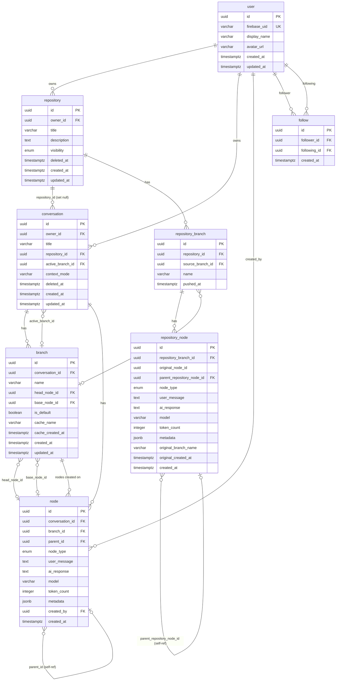

```mermaid
erDiagram
      user {
          uuid id PK
          varchar firebase_uid UK
          varchar display_name
          varchar avatar_url
          timestamptz created_at
          timestamptz updated_at
      }

      repository {
          uuid id PK
          uuid owner_id FK
          varchar title
          text description
          enum visibility
          timestamptz deleted_at
          timestamptz created_at
          timestamptz updated_at
      }

      conversation {
          uuid id PK
          uuid owner_id FK
          varchar title
          uuid repository_id FK
          uuid active_branch_id FK
          varchar context_mode
          timestamptz deleted_at
          timestamptz created_at
          timestamptz updated_at
      }

      branch {
          uuid id PK
          uuid conversation_id FK
          varchar name
          uuid head_node_id FK
          uuid base_node_id FK
          boolean is_default
          varchar cache_name
          timestamptz cache_created_at
          timestamptz created_at
          timestamptz updated_at
      }

      node {
          uuid id PK
          uuid conversation_id FK
          uuid branch_id FK
          uuid parent_id FK
          enum node_type
          text user_message
          text ai_response
          varchar model
          integer token_count
          jsonb metadata
          uuid created_by FK
          timestamptz created_at
      }

      repository_branch {
          uuid id PK
          uuid repository_id FK
          uuid source_branch_id FK
          varchar name
          timestamptz pushed_at
      }

      repository_node {
          uuid id PK
          uuid repository_branch_id FK
          uuid original_node_id
          uuid parent_repository_node_id FK
          enum node_type
          text user_message
          text ai_response
          varchar model
          integer token_count
          jsonb metadata
          varchar original_branch_name
          timestamptz original_created_at
          timestamptz created_at
      }

      follow {
          uuid id PK
          uuid follower_id FK
          uuid following_id FK
          timestamptz created_at
      }

      user ||--o{ repository : "owns"
      user ||--o{ conversation : "owns"
      user ||--o{ node : "created_by"
      user ||--o{ follow : "follower"
      user ||--o{ follow : "following"

      repository ||--o{ conversation : "repository_id (set null)"
      repository ||--o{ repository_branch : "has"

      conversation ||--o{ branch : "has"
      conversation }o--o| branch : "active_branch_id"
      conversation ||--o{ node : "has"

      branch }o--o| node : "head_node_id"
      branch }o--o| node : "base_node_id"
      branch ||--o{ node : "nodes created on"

      node }o--o| node : "parent_id (self-ref)"

      repository_branch ||--o{ repository_node : "has"
      repository_branch }o--o| branch : "source_branch_id (set null)"

      repository_node }o--o| repository_node : "parent_repository_node_id (self-ref)"
```